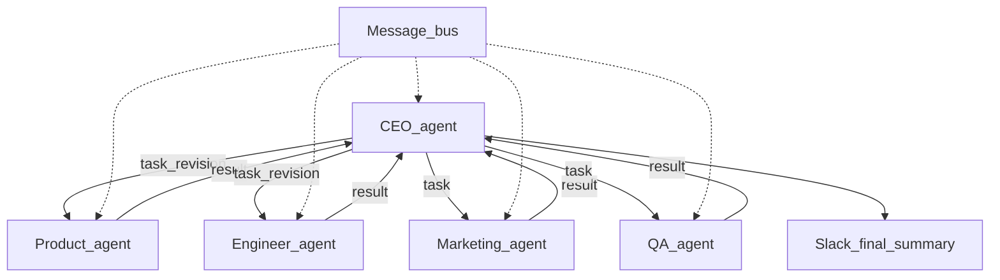

# LaunchMind — Multi-Agent Startup System

A multi-agent system (MAS) that takes a startup idea and runs it through **Product**, **Engineer**, **Marketing**, and **QA** agents with a **CEO** orchestrator. Agents exchange **structured JSON messages** on an in-process message bus. The Engineer opens a real **GitHub** pull request; Marketing sends a real **SendGrid** email and posts **Slack Block Kit** messages; the CEO posts a final summary to Slack.

## Startup idea (edit for your group)

**LaunchMind** helps very small teams simulate a product launch: autonomous agents produce a product spec, a landing-page HTML prototype, marketing copy, and real integrations (GitHub PR, email, Slack) so you can demonstrate end-to-end agent collaboration. Replace this paragraph in your README with your own concrete idea (target user, core feature, why it matters).

## Architecture



- **CEO** (LLM): decomposes the idea into focus areas; reviews the product spec and may request revisions; after the Engineer PR exists, tasks Marketing; runs QA and may ask the Engineer to revise; posts a **CEO final summary** to Slack.
- **Product** (LLM): emits `value_proposition`, personas, ranked features, user stories.
- **Engineer** (LLM + GitHub API): HTML landing page; GitHub issue **Initial landing page**; branch; commit with author `EngineerAgent <agent@launchmind.ai>`; pull request.
- **Marketing** (LLM + SendGrid + Slack): tagline, copy, cold email, social drafts; email via SendGrid; **Block Kit** post to `#launches` including the PR link.
- **QA** (LLM + GitHub): reviews HTML and copy; posts **at least two inline PR comments** on the landing file; pass/fail to CEO (fail triggers an Engineer retry when retries remain).

## Setup

1. **Clone** this repository (or copy the project folder).

2. **Python 3.11+** recommended. Create a virtual environment:

   ```bash
   python3 -m venv .venv
   source .venv/bin/activate   # Windows: .venv\Scripts\activate
   pip install -r requirements.txt
   ```

3. **Copy** [`.env.example`](.env.example) to `.env` and fill in real values (never commit `.env`).

4. **External accounts** (required for a full run):

   - **GitHub**: public repo; classic PAT with `repo`; set `GITHUB_REPO=owner/name`.
   - **Slack**: bot token with `chat:write`, `channels:read`, `channels:join`; invite the bot to `#launches` (or set `SLACK_CHANNEL` to a channel ID).
   - **SendGrid**: API key, verified sender → `SENDGRID_FROM_EMAIL`; recipient → `TEST_EMAIL`.
   - **LLM**: `ANTHROPIC_API_KEY` (default) or `OPENAI_API_KEY` with `LLM_PROVIDER=openai`.

5. **Optional smoke checks** (with `.env` loaded):

   ```bash
   python scripts/smoke_platforms.py
   ```

## Run

```bash
source .venv/bin/activate
python main.py "Your startup idea text here"
```

Or set `STARTUP_IDEA` in `.env` and run `python main.py`.

The terminal prints CEO progress, the full **message bus history**, and the **CEO decision log**.

## Tests (no external APIs)

```bash
pytest -q
```

## Platforms and actions

| Platform | What agents do |
|----------|----------------|
| **LLM API** | CEO decomposition and reviews; Product, Engineer, Marketing, QA generation |
| **GitHub** | Issue, branch, commit landing HTML, open PR; QA inline review comments |
| **SendGrid** | Marketing cold email (subject/body from LLM) |
| **Slack** | Marketing launch Block Kit post; CEO final summary Block Kit post |

## Links for submission (fill after your first successful run)

- **GitHub PR** (from Engineer): *add URL here*
- **Slack workspace** (invite link) or screenshots: *add here*

## Repository layout

- [`main.py`](main.py) — entry point  
- [`message_bus.py`](message_bus.py) — shared in-process queues + history  
- [`schemas.py`](schemas.py) — message validation  
- [`llm.py`](llm.py) — Anthropic / OpenAI helper  
- [`agents/`](agents/) — one module per agent  

## Group member ↔ agent ownership

Document in your course submission which student owns which agent (assignment requirement).
# launchmind-i221987
