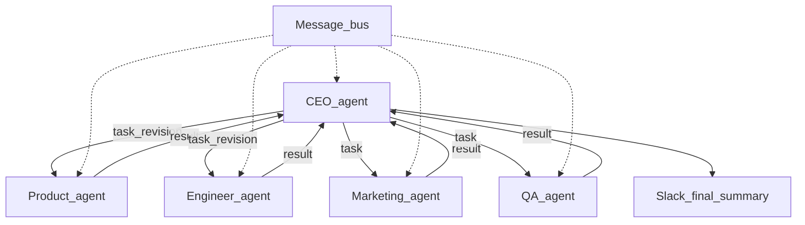

# LaunchMind — Multi-Agent Startup System

**FAST Agentic AI — Group project.** Five LLM-powered agents (**CEO**, **Product**, **Engineer**, **Marketing**, **QA**) collaborate over a **JSON message bus** to take a startup idea from spec to launch-style outputs: the **Engineer** opens a real **GitHub** PR; **Marketing** sends a real **SendGrid** email and posts **Slack Block Kit** to `#launches`; the **CEO** reviews work and posts a final Slack summary. **Startup focus:** connecting **local artisans** with nearby buyers (listings, chat, pickup scheduling).

> **GitHub “About” blurb (copy into repo → ⚙️ → *About* → Description):**  
> *Five autonomous agents (CEO, Product, Engineer, Marketing, QA) run a micro-startup end-to-end: product spec, landing-page PR, marketing email, and Slack—with real GitHub, SendGrid, and Slack integrations. FAST multi-agent assignment (i221987 / i222048 / i222003).*

## Startup idea

**Local artisan marketplace (mobile app):** connect local artisans and small makers with nearby buyers through simple listings, chat, and pickup scheduling—so communities can discover handmade goods and support local makers without relying only on generic e-commerce platforms.

## Architecture



- **CEO** (LLM): decomposes the idea into focus areas; reviews the product spec and may request revisions; after the Engineer PR exists, tasks Marketing; runs QA and may ask the Engineer to revise; posts a **CEO final summary** to Slack.
- **Product** (LLM): emits `value_proposition`, personas, ranked features, user stories.
- **Engineer** (LLM + GitHub API): HTML landing page; GitHub issue **Initial landing page**; branch; commit with author `EngineerAgent <agent@launchmind.ai>`; pull request.
- **Marketing** (LLM + SendGrid + Slack): tagline, copy, cold email, social drafts; email via SendGrid; **Block Kit** post to `#launches` including the PR link.
- **QA** (LLM + GitHub): reviews HTML and copy; posts **at least two inline PR comments** on the landing file; pass/fail to CEO (fail triggers an Engineer retry when retries remain).

## Setup

1. **Clone** this repository (or copy the project folder).

2. **Python 3.11+** recommended. Create a virtual environment:

   ```bash
   python3 -m venv .venv
   source .venv/bin/activate   # Windows: .venv\Scripts\activate
   pip install -r requirements.txt
   ```

3. **Copy** [`.env.example`](.env.example) to `.env` and fill in real values (never commit `.env`).

4. **External accounts** (required for a full run):

   - **GitHub**: public repo; classic PAT with `repo`; set `GITHUB_REPO=owner/name`.
   - **Slack**: bot token with `chat:write`, `channels:read`, `channels:join`; invite the bot to `#launches` (or set `SLACK_CHANNEL` to a channel ID).
   - **SendGrid**: API key, verified sender → `SENDGRID_FROM_EMAIL`; recipient → `TEST_EMAIL`.
   - **LLM**: `GROQ_API_KEY` with `LLM_PROVIDER=groq` (see `.env.example`), or `ANTHROPIC_API_KEY` / `OPENAI_API_KEY` with matching `LLM_PROVIDER`.

5. **Optional smoke checks** (with `.env` loaded):

   ```bash
   python scripts/smoke_platforms.py
   ```

## Run

```bash
source .venv/bin/activate
python main.py "Your startup idea text here"
```

Or set `STARTUP_IDEA` in `.env` and run `python main.py`.

The terminal prints CEO progress, the full **message bus history**, and the **CEO decision log**.

## Tests (no external APIs)

```bash
pytest -q
```

## Platforms and actions

| Platform | What agents do |
|----------|----------------|
| **LLM API** | CEO decomposition and reviews; Product, Engineer, Marketing, QA generation |
| **GitHub** | Issue, branch, commit landing HTML, open PR; QA inline review comments |
| **SendGrid** | Marketing cold email (subject/body from LLM) |
| **Slack** | Marketing launch Block Kit post; CEO final summary Block Kit post |

## Links for submission

| Item | Link |
|------|------|
| **Public GitHub repository** | https://github.com/AnasA18H/launchmind-i221987 |
| **Demo video** | *Add your YouTube/Drive URL here when ready* |
| **Example PR opened by Engineer agent** | https://github.com/AnasA18H/launchmind-i221987/pull/18 *(update if your latest run used a different PR)* |
| **Slack workspace** (invite) | https://join.slack.com/t/i221987/shared_invite/zt-3uqnfw65u-Cc0j8cpheSCM0fip7f_CDQ |

## Group members and agent ownership

Each student owns at least one agent end-to-end (implementation, testing, demo). Split for this group:

| Roll # | Name | Agent(s) owned | Main file(s) |
|--------|------|------------------|--------------|
| **i221987** | Mohammad Anas | **CEO** (orchestrator, decomposition, reviews, final Slack summary) | [`agents/ceo_agent.py`](agents/ceo_agent.py), [`main.py`](main.py) wiring |
| **i222048** | Sahil Kumar | **Product**, **Marketing** | [`agents/product_agent.py`](agents/product_agent.py), [`agents/marketing_agent.py`](agents/marketing_agent.py) |
| **i222003** | Abubakkar Nadeem | **Engineer**, **QA** | [`agents/engineer_agent.py`](agents/engineer_agent.py), [`agents/qa_agent.py`](agents/qa_agent.py) |

**Shared infrastructure** (whole group collaborates, often led by CEO owner): [`message_bus.py`](message_bus.py), [`schemas.py`](schemas.py), [`llm.py`](llm.py), [`slack_utils.py`](slack_utils.py).


## Repository layout

- [`main.py`](main.py) — entry point  
- [`message_bus.py`](message_bus.py) — shared in-process queues + history  
- [`schemas.py`](schemas.py) — message validation  
- [`llm.py`](llm.py) — Anthropic / OpenAI / Groq helper  
- [`agents/`](agents/) — one module per agent  

